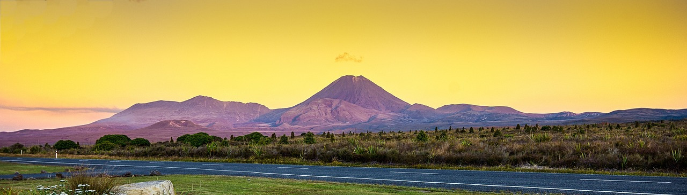

# Neuseelandreise HOWTO - HTML Grundgerüst

## 1. Vorbereitung

* `index.html` Datei erstellen und den `html 5` Baustein von VSCode einfügen

    [🔗 COMMIT](https://github.com/webmapping23s/nz/commit/f4bd43d9dfdadd6ae15e141bc49452d1832d2d91)

* **Sidestep VSCode Hilfestellungen**
	* Bausteine wie z.B. oben, autocomplete bei allen Elementen, Attributen
    * Tooltips bei Elementen & Attributen *onmouseover*
    * Links zur [MDN Reference](https://developer.mozilla.org/en-US/docs/Web/HTML) für jedes html-Element verfügbar
    * mit dem "Live Server" Plugin können wir einen lokalen Webserver starten und uns die Seite (wie im Internet) ansehen

## 2. Die HTML-Seite entwickeln

* Seitentitel als &lt;title> Element ergänzen und Seitensprache über das `lang`-Attribut auf Deutsch (`de`) ändern

    [🔗 COMMIT](https://github.com/webmapping23s/nz/commit/5e35f9bd9894905bbe361ca28d53aade2f0357c3)

    ```html
    <html lang="de">

    <title>Neuseelandreise</title>
    ```

* Titel als &lt;h1> Element (für *header 1*) setzen

    [🔗 COMMIT](https://github.com/webmapping23s/nz/commit/484e2f5cf345e468cde1fcf050363f9f96c103aa)

    ```html
    <h1>Neuseelandreise</h1>
    ```

* Untertitel als &lt;h2> Element (für *header 2*) setzen

    [🔗 COMMIT](https://github.com/webmapping23s/nz/commit/2870ff7def2854f0c905d611848e8a3d40ebf0b4)

    ```html
    <h2>Tongariro-Nationalpark</h2>
    ```

* Introtext als &lt;p> Element (für *paragraph*) mit weichen Zeilenumbrüchen als &lt;br> Element (für *break*) hinzufügen.  Wikipedia-Suche "*Tongariro-Nationalpark*", dann die ersten drei Absätze kopieren

    [🔗 COMMIT](https://github.com/webmapping23s/nz/commit/0d5ca5017dce46df5f7dd9b540e897630dad47bd)

    ```html
    <p>Der Tongariro-Nationalpark  ... Weltnaturerbe der UNESCO. <br> ... heilig verehren</p>
    ```

* Link zur Quelle als &lt;a> Element (wie *anchor*) ergänzen

    [🔗 COMMIT](https://github.com/webmapping23s/nz/commit/dbd2c740d7ec45ca965f2381995ae96ebba3d9c4)

    ```html
    (Quelle: <a href="https://de.wikipedia.org/wiki/Tongariro-Nationalpark">Wikipedia</a> )
    ```

    * das Link-Ziel wird durch das `href`-Attribut (wie *Hyperlink reference*) bestimmt
    * der Linktext steht zwischen `<a href="">` und `</a>`

* Quelltext mit dem VS Code Befehl `F1 / Format Document` formatieren - das bringt etwas Struktur in den Code und hilft später bei Skripts und Stylesheets noch viel mehr

    [🔗 COMMIT](https://github.com/webmapping23s/nz/commit/acd9659b4353e532c3bbefddc8692d261e7c8a8f)

* Bild einer Attraktion im Netz suchen und speichern

    * ein frei verfügbares Bild ohne Copyright Einschränkungen bei [https://pixabay.com](https://pixabay.com) suchen: Keyword "*tongariro*" führt unter anderem zu einem Bild der *Emerald Lakes* unter [https://pixabay.com/de/photos/neuseeland-tongariro-crossing-83645/](https://pixabay.com/de/photos/neuseeland-tongariro-crossing-83645/)
    * die 1280 px breite Variante speichern
    * Speicherort ist ein neues Unterverzeichnis `images/`
    * Dateiname ist `attraction.jpg`
  
    [🔗 COMMIT](https://github.com/webmapping23s/nz/commit/4f303d1c976b33257fa77c0b1e8966f20153a92f)

* Bild der Attraktion als Abbildung mit Bildunterschrift einbauen

    * die Abbildung als &lt;figure> Element mit einem Bild als &lt;img> Element  definieren
    
        [🔗 COMMIT](https://github.com/webmapping23s/nz/commit/fb5f32dfd8a72f75fc7e7c041c0446bbf2a31055)

        ```html
        <figure>
            
        </figure> 
        ```

        * das &lt;img> Element benötigt (mindestens) zwei Attribute
            * das `src`-Attribut (wie *source*) mit dem Ablageort des Bildes
            * das `alt`-Attribut (wie *alternative*) als Beschreibung des Bildes für Screenreader

    * die Bildunterschrift folgt unterhalb des &lt;img> Elements als &lt;figcaption> Element mit einem &lt;a> Element für den Link zur Bildquelle
    
        [🔗 COMMIT](https://github.com/webmapping23s/nz/commit/e14bfae39f4c9dde513ef392df31f3d151d6bfd8)

        ```html
        <figure>
            
            <figcaption>Drei Vulkanseen am verschneiten Gipfel des Tongariros
                (Quelle: <a href="https://pixabay.com/photos/new-zealand-tongariro-crossing-83645/">tongariro@pixabay</a>
            </figcaption>
        </figure>
        ```

* **Bildbearbeitung in GIMP**: das Bild ist zu groß, wir verkleinern es

    * `GIMP` starten und das Bild `images/attraction.jpg`  laden
        * Bild -> Bildgröße -> 900 x *Höhe ändert sich automatisch* -> Größe ändern
        * Datei -> Exportieren nach -> `images/attraction.jpg` -> Exportieren
            * Qualität: 90
            * Vorschau speichern weg
            * EXIF, XMP, IPTC weg (das sind die Bildmetadaten, die auch sensible Werte haben können, z.B. Zeit, GPS-Location, vergebene eigene Tags, etc.)

* die Überschrift beim &lt;h2> Element mit einem &lt;em> Element kursiv formatieren

    [🔗 COMMIT](https://github.com/webmapping23s/nz/commit/df0c10b79fcd9565ec78a4d847cfdeb42f02aa30)

    ```html
    <h2><em>Tongariro-Nationalpark</em></h2>
    ```

* einen beliebigen Begriff im Beschreibungsabsatz mit einem &lt;strong> Element fett formatieren

    [🔗 COMMIT](https://github.com/webmapping23s/nz/commit/aad85193618e0a85e464d8eb502ff8e7057cb149)

    ```html
    <strong>Kultstätten der Māori</strong>
    ```

* eine Linkliste als &lt;ul> Element (wie *unordered list*) mit drei weiterführenden Links als &lt;a> Elemente verpackt in &lt;li> Elements (wie *list item*) hinzufügen. Vor der Linkliste die Überschrift *Links* als &lt;h3> Element ergänzen

    [🔗 COMMIT](https://github.com/webmapping23s/nz/commit/dc6cf6934e335922d2561327c01b6d22d036d55a)

    ```html
    <h3>Links</h3>
    <ul>
        <li><a href="https://...">...</a></li>
        <li><a href="https://...">...</a></li>
        <li><a href="https://...">...</a></li>
    </ul>
    ```

* die Navigation zu den Nachbaretappen als &lt;nav> Element (wie *navigation*) mit zwei &lt;a> Elementen ergänzen. Das `href`-Attribut der Links leiten wir über die Usernamen der Nachbarn ab - wir finden sie in der Etappentabelle `nz_etappen.ods` im OLAT Kurs. Das Muster der URL für das `href`-Attribut ist immer gleich: `username.github.io/nz`

    * Unicode-Zeichen für Pfeile unterstreichen die Richtung der Navigation

        * die Pfeile finden wir auf [https://symbl.cc/de/](https://symbl.cc/de/)

        * Suche: Schwerer Barb-Pfeil nach links, auf der Ergebnisseite bei "ähnliche Zeichen" finden wir auch den Pfeil nach rechts / jeweils Kopieren

    [🔗 COMMIT](https://github.com/webmapping23s/nz/commit/fe809e237134c1d8957033e42b9e75da738705a5)

    ```html
    <nav>
        <a href="https://damerow.github.io/nz">🡸 vorhergehende Etappe</a> |
        <a href="https://juba1508.github.io/nz">nächsten Etappe 🡺</a>
    </nav>
    ```

    * mit dem &lt;nav> Element sind wir bei den Strukturelementen angekommen, die unserer Seite etwas mehr Semantik verleihen werden ...

## 3. Seitenstruktur verfeinern

* mit den *sprechenden* Strukturelementen &lt;header>, &lt;main>, &lt;article>, &lt;footer> gleich unter dem &lt;body> Element die Seitenstruktur definieren

    [🔗 COMMIT](https://github.com/webmapping23s/nz/commit/85efd281330e50181c945b89b4c5d7ed5c84bf0d)

    ```html
    <body>
        <header></header>
        <main>
            <article></article>
        </main>
        <footer></footer>
    </body>
    ```

* den ganzen bisher geschriebenen Content in das &lt;article> Element verschieben. Die Etappennavigation kommt in den &lt;footer>

    [🔗 COMMIT](https://github.com/webmapping23s/nz/commit/a8340581ffc4e391aba52dbb14b9cc85262ab942)


* mit `F1 / Format Document` den Quelltext säubern

    [🔗 COMMIT](https://github.com/webmapping23s/nz/commit/b05aeec12af2a3078bc234e1805063fd217d9017)

## 4. Headerbereich mit Banner und Usericon erstellen

* zuerst ein Bannerbild für den Header bei [https://pixabay.com](https://pixabay.com) suchen
    * Suche "*Tongariro*" führt zu [https://pixabay.com/de/photos/tongariro-vulkan-herr-der-ringe-583179/](https://pixabay.com/de/photos/tongariro-vulkan-herr-der-ringe-583179/)
    * Die Version mit 1280 Pixel Breite downloaden
        * Speicherort im Unterverzeichnis `images/`
        * Bildname `header.jpg`

        [🔗 COMMIT](https://github.com/webmapping23s/nz/commit/ec027c507347c7a561a758feed1a6d42add2f64b)

    * Bannerbild im &lt;header> als &lt;img> Element einbauen
    
        [🔗 COMMIT](https://github.com/webmapping23s/nz/commit/f98d0093b93fe943afd087587d363b7c75c64451)

        ```html
        <header>
            
        </header>
        ```

    * **Bildbearbeitung in GIMP**: das Bannerbild mit 1280x365 Pixel ausstanzen

        * Bild -> Leinwandgröße -> 1280 x 365 -> Größe ändern
        * Ebene -> Ebene auf Bildgröße
        * Datei -> Exportieren nach -> `images/header.jpg` -> Exportieren
            * Qualität: 90
            * Vorschau speichern weg
            * EXIF, XMP, IPTC weg

        * [🔗 COMMIT](https://github.com/webmapping23s/nz/commit/4cdfd8434c2023c6845dffdab1ca1f1c1c2aef4f)


* analog zum Bannerbild ein Userbild bei [https://pixabay.com](https://pixabay.com) suchen

    * Suche "Bus" führt zu [https://pixabay.com/de/photos/vw-bus-vw-bully-volkswagen-meer-1845719/](https://pixabay.com/de/photos/vw-bus-vw-bully-volkswagen-meer-1845719/)

    * wir speichern diesmal direkt das Vorschaubild
        * Unterverzeichnis `images/`
        * Bildname `user.jpg`

    * **Bildbearbeitung in GIMP**: ein quadratische Bild ausstanzen und auf 100x100 Pixel bringen

        * Doppelklick auf das Symbol "rechteckige Auswahl"
            * oder Werkzeuge -> Auswahlwerkzeuge -> Rechteckige Auswahl (R)
            * F1 drücken wenn über dem Eintrag zeigt Hilfe im Web

        * Seitenverhältnis -> Fixiert -> 1:1 einstellen
        * Rahmen aufziehen und mit Drag positionieren
        * Position und Größe werden angezeigt, auch der Bildmittelpunkt
        * Größe kann auch an den Ecken geändert werden
        * Wenn alles passt:

            * Bild -> Auf Auswahl zuschneiden
            * Bild -> Bild skalieren -> 100x100 -> Skalieren
            * Datei -> Exportieren nach -> images/user.jpg -> Exportieren
                * Qualität: 100 (ist ja ohnehin klein)
                * Vorschau speichern weg
                * EXIF, XMP, IPTC weg

        [🔗 COMMIT](https://github.com/webmapping23s/nz/commit/1a818f992edf6d9c33db450aaa967ee1db517ea5)

* Userbild mit Bildquelle und Bild als Link direkt unter dem Bannerbild einbauen. Der Link geht zum eigenen github Account

    [🔗 COMMIT](https://github.com/webmapping23s/nz/commit/73086511741229e8a876026da8fdd7c882baa443)

    ```html
    <a href="https://github.com/webmapping23s">
        
    </a>
    ```

* die Bildquellen als Kommentare (für jetzt) hinzufügen

    [🔗 COMMIT](https://github.com/webmapping23s/nz/commit/e61befc2209ee33c1dd9605142c9ff6b4d294a5f)

    ```html
    <!-- Bildquelle: https://pixabay.com/photos/tongariro-volcano-lord-who-rings-583179/ -->
    <!-- Bildquelle: https://pixabay.com/photos/vw-bus-vw-bully-volkswagen-sea-1845719/ -->
    ```

## Das Grundgerüst für die Etappenseite ist damit fertig

Online unter: [https://webmapping23s.github.io/nz](https://webmapping23s.github.io/nz)
